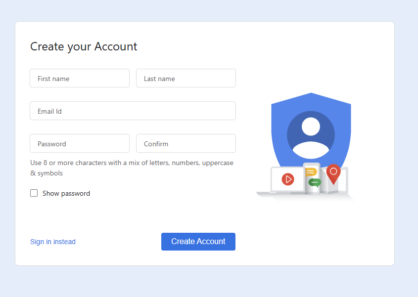

# Google Docs Clone

## ⭐ Introduction
This project is a clone of **Google Docs**, designed to provide a collaborative document editing experience similar to Google Docs. It allows multiple users to create, edit, and collaborate on documents in real-time.

## 🟢 Features
- **Document Creation and Storage**: Users can create new documents and store them securely in the database.
- **Real-time Document Editing**: Multiple users can collaborate and edit the same document simultaneously, with changes reflected instantly for all participants.
- **Real-time Sync**: Changes made by different users are automatically synchronized across all connected clients, ensuring seamless collaboration.
- **Rich Text Editing**: The Quill text editor provides a rich editing experience, allowing users to format text, add images, and more.

## 🔧 Tech-Stack
### **Frontend:**
- React.js
- Quill
- shadcn/ui

### **Backend:**
- Node.js
- Socket.io

### **Database:**
- MongoDB

### **Other Tools:**
- TypeScript
 

## ▶️ Getting Started
To get a local copy up and running, please follow these simple steps.

## 🟡 Prerequisites
Ensure you have the following installed:
- **Node.js** (Version: >=18.x)
- **MongoDB** (Local or Cloud)
- **npm / yarn**

## 💻 Development
### 🟢 Setup (without Docker):
1. **Clone the repository**
   ```bash
   git clone https://github.com/bhanusingh10/google-sheet-clone.git
   ```
2. **Navigate to the server directory**
   ```bash
   cd server
   ```
3. **Install server dependencies**
   ```bash
   npm install
   ```
   or
   ```bash
   yarn install
   ```
4. **Set up environment variables**
   - Create a new file named `.env` inside `Google-Docs-Clone/server`.
   - Add the following variables:
     ```env
     DATABASE_URL=<your_mongodb_connection_url>
     CLIENT_ORIGIN=http://localhost:5173
     ```
5. **Start the backend server**
   ```bash
   npm run dev
   ```
   The backend server will now be running on `http://localhost:3000`.

6. **Open a new terminal and navigate to the client directory**
   ```bash
   cd client
   ```
7. **Install client dependencies**
   ```bash
   npm install
   ```
8. **Set up client environment variables**
   - Create a new file named `.env` inside `Google-Docs-Clone/client`.
   - Add the following variable:
     ```env
     VITE_SERVER_URL=http://localhost:3000
     ```
9. **Start the client application**
   ```bash
   npm run dev
   ```
   The React app will now be running on `http://localhost:HOST`.
 
## 📸 Screenshots

1. **Signup**
   

2. **Signin**
   

3. **Initilize google Sheet**
   

4. **Sheet interface**
   


